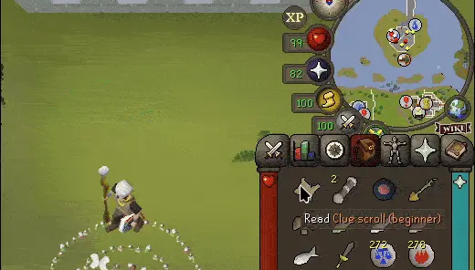
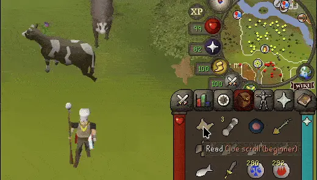
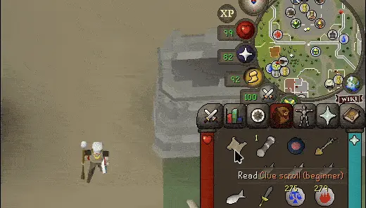

# True Tile Clue Areas

A RuneLite plugin that highlights the **true dig/emote area** for clue scroll steps, instead of the single tile that the base clue scroll plugin highlights.
## Preview
### Map clue

### Hot&Cold clue

### Emote clue

## Features

- Highlights the true dig area for **map clue** steps
- Highlights the true location area for **emote clue** steps
- Highlights the true dig area for **hot/cold clue** steps
- Highlights the true dig area for **coordinate clue** steps - *Coming soon*
- Highlights the true dig area for **cryptic clue** steps - *Coming soon*
- Configurable — toggle each clue type on/off, change highlight colors

## Supported Clue Tiers

| Tier | Map Clues | Emote Clues | Hot/Cold | Coordinate | Cryptic |
|------|-----------|-------------|----------|----------|----------|
| Beginner | ✅ Verified | ✅ Verified | ✅ Verified | N/A | N/A |
| Easy | 🔲 Needs data | 🔲 Needs data | N/A | N/A | 🔲 Needs data |
| Medium | 🔲 Needs data | 🔲 Needs data | N/A | 🔲 Needs data | N/A |
| Hard | 🔲 Needs data | 🔲 Needs data | N/A | 🔲 Needs data | 🔲 Needs data |
| Elite | 🔲 Needs data | 🔲 Needs data | N/A | 🔲 Needs data | 🔲 Needs data |
| Master | 🔲 Needs data | 🔲 Needs data | 🚧 In Progress | 🔲 Needs data | 🔲 Needs data |

#### [Instructions on how to contribute data!](contributing.md)
